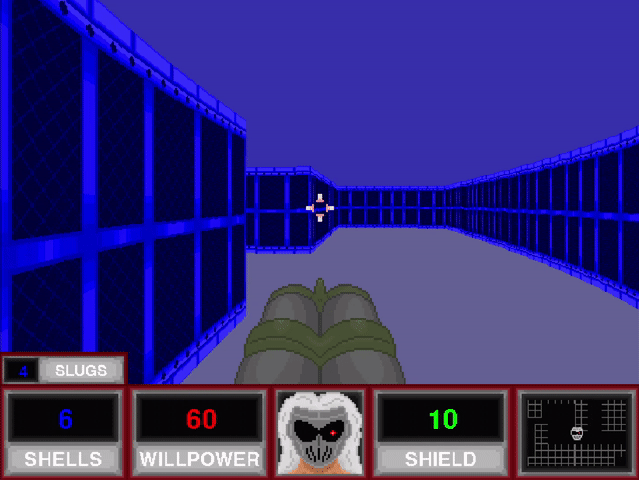
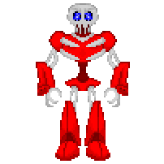
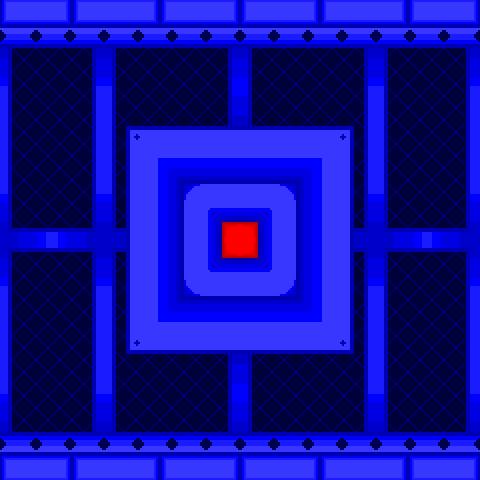
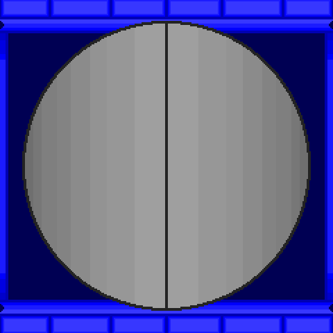

# DOOD

## Overview

Welcome to DOOD! A first person shooter where you play as the Dood Man Guy, a cybernetically enhanced frat bro, in space, fighting through hordes of robot demons, who are also possesed by ghosts!

The game currently features:
- Two Levels
- DOOD's Shotgun, firing either shells or slugs
- A raycasting rendering system inspired by Wolfenstein 3D and, of course, Doom (1993)
- Sound effects, some of which were stolen from Doom, and others created by us 
- A "fully voiced" protagonist (actually just two lines, but shhhh)

## Running DOOD

There are no system requirements per se, but don't complain if you run this on your toaster and get bad results. The raycasting is decently optimised, so it should run okay on most systems!
Plus, the game runs at 640x480 and 30fps, to really sell the retro shooter aesthetic! And in case my optimisation wasn't good enough.

To run the game, you must have the latest version of both Python and Pygame installed, along with these modules:
- time
- math
- collections

All of these are included in most default Python installs. Once all of these have been installed, run main.py

**ALTERNATIVELY, RUN DOOD.EXE! THIS IS A FULLY COMPILED VERSION IN AN EXECUTABLE FORMAT AND I'M VERY PROUD THAT IT EXISTS**

## Playing DOOD

DOOD is a first person shooter, with similar controls to other retro shooters. However, there are differences.
- WASD to move
- Mouse OR Left/Right arrow keys to turn
- Spacebar/Left Mouse Button to fire your weapon
- E to interact with buttons and level exits
- Escape can be used to exit the game at any time

### Enemies

There is currently one type of enemy: the Skeleton Cyborg

After seeing the player, they will relentlessly chase them down, firing at them when close enough. Shoot them back to take care of them!

### Pickups

There are currently four item pickups scattered throughout each level.

Medkits restore 20 health if the player is below 100 Willpower, or 10 if above.

Shield Containers restore 10 shield if the player is below 50 Shield, or 5 if above.

Turtle Shells give the player 5 shells to use in their shotgun.

Slugs give the player 5 slugs to use in their shotgun.

### Buttons and Airlocks

Throughout each level, you may find a locked door!

To open them, you will need to find and press a button hidden nearby (using E).

This will open the door, giving you access to whatever is past it.

Airlocks are the exits for each level. Walk up to it and press E to complete the level! Killing all the enemies is not required to do this.

## Credits

While we each did a bit of everything, here's the summary.

Programming - Duncan Nickel

Graphics & Art - Jack Townsend

**NOTE ABOUT THE SOUNDS**

Weapon sounds, health/shield pickups, and the level exit sounds are all originally from Doom (1993). Since Doom (1993) was released under a shareware license, this might be okay? I don't think Bethesda is gonna assassinate me for this, so whatever.

On the other hand, all other sounds were created by Duncan! This includes the ammo pickup, button press, and enemy hit sounds. And yes, he did also do the voice for the Dood Man Guy, including hurt/death sounds! Go give those a listen, they're funny.